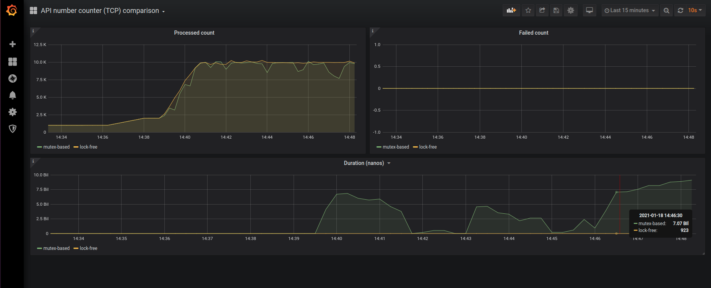

# lock-free-research

Check lock-free algorithms performance.

Use counter service as subject of testing.

Do 2 implementation - with mutexes and lock-free.

### Benchmarks

```bash
make stand
# check prometheus target is ready (use link in output)

go build
./lock-free-research util counter-spam --addr=192.168.0.211:10001 --concurrent=10000 --interval=50ms
./lock-free-research util counter-spam --addr=192.168.0.211:10002 --concurrent=10000 --interval=50ms
# where 192.168.0.211 is performance stand IP

```

### Files

* **internal/api/tcp_counter_mutex_based/counter.go** - mutex-based impl
* **internal/api/tcp_counter_lock_free/counter.go** - lock-free impl

### Report

#### Performance stand (bare-metal)

* AMD Ryzen 9 3900 12-Core Processor
* RAM 32 Gb
* Limits - defined in **docker-compose.yaml** (cpu quota = 4000, mem limit = 2048M for each daemon counter impl)
* Networking - 10k load inside local network (192.168.x.*/24)

#### Metrics



##### Explanation

Load was increased from 1-1,5k to 10k RPS.

During all this experiment, lock-free implementation spend 900-930 nanoseconds.

When RPS lower than 5k, mutex-based impl spend 970-990 nanoseconds.

When RPS exceed 5k, processing duration for mutex-based impl sometimes spend 1-8 seconds (1-8 billions nanoseconds).

### Useful links

* [Lock-free theory (RU)](https://habr.com/ru/company/wunderfund/blog/322094/)
* [Compare-and-swap (CAS) operation](https://en.wikipedia.org/wiki/Compare-and-swap)
* [LB for compose](https://pspdfkit.com/blog/2018/how-to-use-docker-compose-to-run-multiple-instances-of-a-service-in-development/)
* [Nginx LB for TCP & UPD](https://docs.nginx.com/nginx/admin-guide/load-balancer/tcp-udp-load-balancer/)
